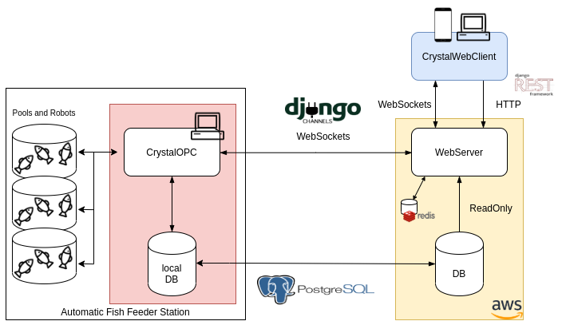

2020 started for Fiqus with a great work and intercooperation experience.

It all began when we met [SofiCoop](https://soficoop.com/), a Software Cooperative from Israel. Some of SofiCoop’s members are in contact and making volunteering work with [CrystalVision](http://crystalvision.co.il/), another Cooperative from Israel located in the Kibbutz Samar (situated in Arava valley in the far south of Israel).

 
As part of the volunteering, one of the partners from SofiCoop is in charge of building a web application for a CrystalVision’s product, an Automatic Fish Feeder.

The web application (CrystalWebClient) have remote control over the desktop automation system (CrystalOPC). But as this desktop system can not expose any kind of communication to the “outside”, they started thinking that maybe they would need something to establish that communication.

Due to that need, SofiCoop called us (Fiqus) to become part of the challenge. We rolled up our sleeves, put our feet in the water (without disturbing the fish) and we started figuring out a solution to the problem. 

At the beginning it was hard for us to understand the real needs, because of that we decided to start the project using the [Product Discovery](https://herbig.co/product-discovery/) technique. With this technique we wanted to get closer to the customer, identify their needs and collect all the information necesary to make decisions, adapt and focus the development to the real need of the customer. Product Discovery not only helped us to build the product the right way, but also gave us tools to build the right product.

Once we identified the real need, we figured out the best implementation for that. From that technical discussion came the idea of building a [WebServer](https://en.wikipedia.org/wiki/Web_server), which allows the centralized communication between the web application and the desktop system. The WebServer should work as a “message handshake” between the two components mentioned previously and should be the interface with a central Data Base which we would use to get the information requested by the web application.

We developed a [REST API](https://en.wikipedia.org/wiki/Representational_state_transfer) with [Django Rest Framework](https://www.django-rest-framework.org/) which can be consumed by the web application to request information about the automatic fish feeder system and it allows to make modifications on the PLCs configuration which are in charge of the fish feeder (food amount, intervals of feeding, etc.).

To perform those modifications we needed a channel through which to establish the communication between the WebServer who receives the modification and the desktop application (CrystalOPC) where the modifications have to be applied on the PLCs. This was solved implementing a connection through [WebSockets](https://en.wikipedia.org/wiki/WebSocket) using the “magic” of [Django Channels](https://channels.readthedocs.io/en/latest/).

Through the WebSocket connection we also implemented a protocol which allows us to know if the connection with the desktop application is still alive. When the desktop application establish the connection using WebSocket we add a key in [Redis](https://redis.io/) (in memory database) which has an expiration time of 25 seconds (configurable). After each 20 seconds the desktop application sends a _heartbeat_ to the WebServer who receives that message and automatically updates the expiration time of the key previously saved in Redis. While that key exists in Redis we can assume that the connection between the desktop application and the WebServer is established. If the WebServer does not receive any _heartbeat_, the key will be automatically removed by Redis after the expiration time, in this case we have the certainty  that the connection is totally down. When the key is not present in Redis, all modification requests that the web application sends to the web server will be automatically rejected.

Here you have a diagram to clarify all the architecture and implementation of it:

Last but not least, the amazing intercooperation experience we were lucky to experience.
 
We at Fiqus have been in the path of building relationships beyond the common customer-provider relation since our inception. The way we naturally work allows us to get closer to customers in a different way, closer to their needs and problems, to their culture. We try to mix all of that with our experience and culture, which allows us to learn and improve by building a better and honest relationship.

In this case, the relationship was just like we described in the previous paragraph. From the very beginning we felt as friends (and they were our customers!). We don’t really know how we managed that, but we guess that working with another cooperative, achieving an honest and good relationship is a natural result of working with people with the same ideology.

Looking forward for your comments or doubts! Keep in touch!

