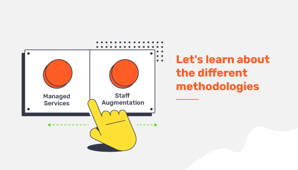

# **Managed services & Staff Augmentation**   
####  Let's get to know the different methodologies 

What do we mean when we say "Staff Augmentation" and when we say "Managed Services"? What are the differences and which is the best option when it comes to hiring devs? 

In this post we will show you all the differences between both hiring models. 

Staff Augmentation is the hiring of individual developers to increase the staff of your company while the managed service is the outsourcing, that is, you hire a team that is in charge of finding a solution according to your problems. Now, what does this mean? 

While in Staff Augmentation the profiles are added as they are needed, in Managed Service the client hires the entire development process, i.e. delegates the responsibility and the solution to an external team. 

Another difference that can be found between the two models is the management of the team: while in Staff Augmentation the client manages the team with individually contracted devs, in Managed Service the team is managed, in this case, by Fiqus and works by objectives. In other words, in this type of model, a whole team that has been working together for years is hired and the management and delivery of the product is included. In Staff Augmentation, on the other hand, the client is responsible for assembling the IT team and managing it. 

So what is the best hiring option? 🤔 The reality is that it all depends on what you are looking for: if you need to add professionals to a pre-existing team, Staff Augmentation is the solution. On the other hand, if you need to develop an idea or create a satellite application to the core with a team of experienced developers and stay focused on the business model, the solution is Managed Service 🦾
