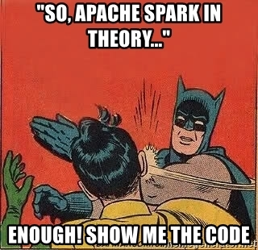
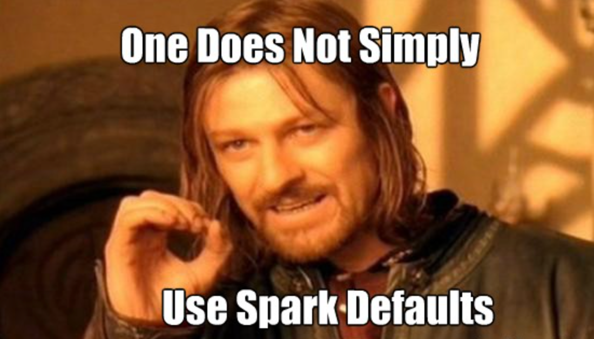

# Creating an application with Spark Structured Streaming
### Code, configurations and considerations

[Apache Spark](https://spark.apache.org/) is an open-source, distributed processing system used for big data workloads. designed to be fast and resilient.
It utilizes in-memory caching and optimized query execution for fast queries against data of any size.
With APIs for `Java`, `Scala`, `Python` and `R`.
It has *Lazy* evaluation, which means any transformation made on the RDDs or Dataframes  creates a logical flow of operations known as *Directed Acyclic Graph (DAG)* which groups operations to improve efficiency and only will execute the operations when the output is needed.


One of the newest features of Spark is the [Structured Streaming](https://spark.apache.org/docs/latest/structured-streaming-programming-guide.html) that provides fast, scalable, fault-tolerant, end-to-end exactly-once stream processing without the user having to reason about streaming.


You can express your streaming computation the same way you would express a batch computation on static data. The **Spark SQL** engine will take care of running it incrementally, continuously and updating the final result as streaming data continues to arrive. You can use the [Dataset/DataFrame](https://spark.apache.org/docs/latest/sql-programming-guide.html) API to express streaming aggregations, event-time windows, stream-to-batch joins.


For a project we had to make metrics over the last 24 hours period reading incoming log lines, sum the new ones and discarding the old ones and outputting the metrics every ~5 minutes.
For solving this problem we used **Structured Streaming** running on an AWS EMR Cluster.




Some simple examples can be found in the [Spark documentation](https://spark.apache.org/docs/latest/structured-streaming-programming-guide.html)
But in real life, solutions will be more complex than that, so here we share a simplified solution of what we have done:


```python
# imports
from datetime import datetime
from pyspark.sql.types import StructType, StringType, StructField, \
   DoubleType, BooleanType, IntegerType
from pyspark.sql import functions as F

# var definition
hours_window = 24
sliding_window = 5
checkpoint_dir = 'hdfs:///checkpoint_folder/'

# helper to create types
def _get_types(types_dict):
   return StructType([(StructField(f_name, f_type, True)) for f_name, f_type in types_dict.items()])

# structure types for the data streaming
LOGLINE_SCHEMA = _get_types({
   'timestamp': StringType(),
   'cost': DoubleType(),
   'clicks': DoubleType(),
})

# read stream definition
logline_df = self.spark \
   .readStream \
   .schema(LOGLINE_SCHEMA) \
   .parquet('hdfs:///mydata/*')

# convert timestamp field for window operation
logline_df = logline_df.withColumn('timestamp', F.to_timestamp('timestamp'))


# add watermark definition
logline_df = logline_df.withWatermark('timestamp', '1 minute')


# compute the metrics
metrics_df = logline_df.groupBy(
   F.window(
      logline_df.timestamp, f'{hours_window} hours', 
      f'{sliding_window} minutes'
   ),
   logline_df.campaign_eid
) \
.agg(
   F.sum('cost').alias('cost'),
   F.sum('clicks').alias('clicks')
)

# start streaming
query = metrics_df.writeStream \
   .option("checkpointLocation", checkpoint_dir) \
   .foreachBatch(collect_metrics_fn) \
   .outputMode('append') \
   .trigger(processingTime=f'{sliding_window} minutes') \
   .start()

# function called for each batch
def collect_metrics_fn(df, epoch_id):
   # do any operations needed in the dataframe
   df = df.withColumn('timestamp', F.lit(datetime.now()))
   # output dataframe
   df.write.mode('overwrite').parquet('hdfs:///output')
```

In the code we can see that we have called `.readStream`
to define the source where we are going to read our [parquet](https://databricks.com/glossary/what-is-parquet) files, in this case  our path is `hdfs:///mydata/`.
In this example we are using the *Hadoop Distributed File System.*

More information about HDFS:
https://hadoop.apache.org/docs/r1.2.1/hdfs_design.html

And in this section
```python
   F.window(
      logline_df.timestamp, f'{hours_window} hours', 
      f'{sliding_window} minutes'
   )
``` 

We define a window period of 24 hours using the *timestamp* field, and sliding every 5 minutes.

To start the streaming we need to call the `writeStream` function.

The `checkpoint` folder definition is very important, because if our job fails or gets restarted will try first to recover from the checkpointed data without having to process all the data from scratch again. 

This will not be possible only if the structure of input data or the streaming queries have changed and breaks the compatibility with the checkpoint structure. If this happens the checkpoint folder needs to be removed *manually* before launching a new job.
The `outputMode` defines how we want the `window` to be processed: the `append` mode will output each window only once the period is considered finished (considering the window + the watermark field).
On the other hand, the `update` mode outputs every window each time it has new data that falls into that period.

More details about `output modes` can be found [here](https://spark.apache.org/docs/latest/structured-streaming-programming-guide.html#output-modes)

And finally the `foreachBatch` option allows passing a function to be called on each batch. It is possible to do manipulations, like adding more fields and writing the output to a desired location.

The parameter `epoch_id` it’s an unique identifier to ensure a only-once guarantee at the moment of writing or processing the data frame.

### Some useful configurations for long running jobs


`spark.sql.streaming.minBatchesToRetain`

This setting indicates the minimum number of checkpoints to be saved for recovery in case of an error.
The default it’s **100**, which can make the size of the folder too big. In the case of processing big amounts of data and running for a long period of time, we’ve seen better performance using smaller values, so we had good results with 5.


`spark.cleaner.referenceTracking.cleanCheckpoints`

This is another important configuration, which by default it’s in false. In true, it will remove the checkpoints that have lost any references.

`spark.default.parallelism`

Tuning this configuration it’s important, as it defines how much *parallelism* a job can have, but it depends on the resources available. Too much parallelism will make the task too small and a lot of overhead, and too low parallelism will underutilize the executors.


A simple math to set a starting value can be the following:
`spark.default.parallelism = spark.executor.instances * spark.executors.cores * 2 (or 3)`

>*More useful configurations for Structured Streming jobs can be found here:*
https://jaceklaskowski.gitbooks.io/spark-structured-streaming/content/spark-sql-streaming-properties.html

### How to deploy a yarn application in EMR

`
aws emr add-steps --cluster-id ClusterID --steps Type=spark,Name=MyApp,Args=[--deploy-mode,cluster,--master,yarn,--conf,spark.yarn.submit.waitAppCompletion=False,--conf,spark.yarn.appMasterEnv.profile=$(profile),--py-files,s3://my-bucket/app-dependencies.zip,s3://my-bucket/my_app.py],ActionOnFailure=CONTINUE
`

With `aws emr add-steps` command we can add a step that will create an application, and setting `waitAppCompletion=False` the step will not wait the app to finish. Being a streaming job, ideally will not finish.


And with this parameter:
`spark.yarn.appMasterEnv.profile`

We can send environment variables to the application, like for example the profile (*staging / produccion*), here the example on how to get it in the code:


`PROFILE = os.getenv('profile', 'staging')`


**Spark Structured streaming** is a great tool, but requires some effort and knowledge to get good results. We hope these insights will help you in this venture.
