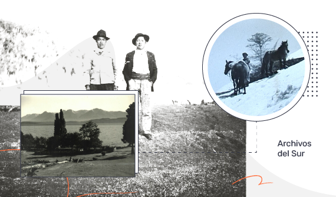

# Archivo digital: el desafío de registrar y compartir las historias para construir memoria colectiva. 

Entrevistamos a Gerardo Ghioldi, participante y creador de Archivos del Sur,  y Joaquín Mansilla, asociado de Cooperativa Fiqus, para que nos cuenten la historia de "Mapeando el Nahuel Huapi, una Construcción Colectiva".

["Mapeando el Nahuel Huapi, una Construcción Colectiva”](http://archivosdelsur.fiqus.coop/) es el resultado digital del trabajo que vienen haciendo desde Archivos del Sur, la subcomisión de la [“Biblioteca Popular Osvaldo Bayer"](https://bibliotecabayer.org.ar/) . El objetivo fue crear una plataforma online, que dé lugar a la pluralidad de voces e historias que han conformado la región. La figura básica de la página web es un mapa interactivo de la zona norte del Parque Nacional Nahuel Huapi, donde se ubica Villa la Angostura, Villa Traful, Cuyin Manzano, La Lipela, Perilago Nahuel Huapi y ruta 40. 

Gerardo Ghioldi vive en Villa La Angostura desde el año ‘87 y trabaja en la “Biblioteca Popular Osvaldo Bayer”  desde los años ‘90, fue uno de los creadores de Archivos del Sur: la subcomisión de la Biblioteca que trabaja recuperando la memoria oral de los viejos pobladores de la zona norte del Parque Nacional Nahuel Huapi y el sur de la provincia de Neuquén. 

El puntapié para crear la subcomisión nace a través del desalojo del *“viejito''* Román Miranda, un poblador de Puerto Manzano en Villa Angostura. Gerardo nos cuenta que: “*En el año 90 y pico salimos a grabar entrevistas con esos viejos grabadores de cassette de audio. Una de las preguntas que nos hicimos fue: dónde estaban los Mapuches de Villa La Angostura; ya que estaban totalmente invisibilizados en la historia local. Y así fue como salimos a buscar a esos apellidos Mapuches y hacerles entrevistas de historias de vida y fue saliendo la otra historia que está silenciada o que está oculta, que se conoce en los viejos pobladores pero que no conocen las nuevas generaciones que va llegando a la Patagonia.”*

Una inquietud que tenían desde Archivos del Sur era cómo devolverles a las familias lo que ellos compartían: sus relatos, sus voces, las de sus padres, sus abuelos.  Con la llegada de internet y las redes sociales se empezó a facilitar esa devolución, primero a través de Facebook y después de Instagram, pero las redes sociales no dejaban de ser limitadas.

*“Tuvimos la oportunidad de que un compañero, Nano, de [Cooperativa Giro Sostenible](https://www.instagram.com/girosostenible.vla/), nos acercara a la Cooperativa Fiqus. Nosotros ya empezábamos a escuchar de fondo que había una Cooperativa de Software en Villa La Angostura, nos parecía algo tirado de los pelos, pero resulta ser que era cierto y  había una serie de jóvenes que venían trabajando en esto de creación de software. Los conocimos y nos asociamos para que nos den una mano y nos asesoren sobre un nuevo mundo que nosotros desconocemos.”  
Joaquín Mansilla es asociado a la Cooperativa Fiqus, fue quien coordinó y trabajó en el proyecto de la plataforma de Archivos del Sur, además es nacido y criado en Villa La Angostura y su familia es parte de la historia de la región: “Para mí,  Archivos era una página de Facebook que seguía, que subían fotos históricas de Villa La Angostura, de la zona de Traful, de Bariloche y era algo que me llamaba bastante la atención. Lo seguía siempre y, cuando ponían una publicación, la miraba. Les fui contagiando el interés a mis compañeros de la coope porque las compartía con ellos y conversábamos sobre la historia.”*

En la pandemia Archivos del Sur y Fiqus se encuentran para unir fuerzas y empezar a trabajar en lo que hoy es el mapeo colectivo. 

**El camino técnico**

Archivos del Sur llega a Fiqus con un objetivo claro: querían poder volcar la información que habían recopilado todos estos años en una plataforma en internet, querían que sea un mapa con marcadores y que cada punto sea o una población o algo que haya sucedido en algún momento en ese lugar. Joaquín nos cuenta que  *“al principio llevamos la idea a la coope y un compañero encontró algo que ya estaba desarrollado que era exactamente lo que querían de Archivos del Sur: un mapeo donde se podían agregar elementos. Enseguida tratamos de levantar el sitio localmente para mostrárselo a la gente de Archivos y les re gustó.  A partir de eso empezamos a sumar: fuimos aprendiendo cómo funcionaba esta herramienta que se llama omeka,  viendo cómo se cargaba información, haciendo encuentros en la Biblioteca Popular Osvaldo Bayer y en diversas reuniones con los participantes de Archivos del Sur fuimos cargando los datos que tenían.*”  Además Joaquín agrega que no sólo se sumaron a desarrollar la parte técnica del proyecto, sino también a “* hacer algunas entrevistas a antiguos pobladores o descendientes de antiguos pobladores.”*

La plataforma se realizó implementando [Omeka](https://omeka.org/) y [Curatespace](https://curatescape.org/). Omeka es un software libre que sirve para compartir colecciones digitales y  exhibiciones digitales interactivas, combina texto narrativo con medios digitales lo que permite tener el mapa y los relatos en un solo sitio. Además, ofrece la opción adaptable para todos los dispositivos. Por otro lado, Curatescape es un conjunto de temas y complementos para Omeka Classic CMS y aplicaciones nativas para dispositivos Android e iOS.

**Objetivos y desafíos**

Gerardo nos cuenta que con el mapeo colectivo se busca “*jugar entre la historia oficial y las distintas opiniones que se fueron dando sobre los mismos hechos históricos, en ese recorrido también tenemos archivos de diarios, notas que vamos publicando en otros medios y en algunos casos un resumen de la historia familiar de una familia X. En uno de esos puntos también hay, por ejemplo, la obra vial, los puentes, la importancia de los puentes para cruzar ríos y como forma de comunicación, la llegada de Parques Nacionales, etc.”* Joaquín agrega:  *“La idea es ir sumando más historias: ahora se sumó poblaciones de Puerto Manzano, de Traful, de Siete Lagos. Hay algunas que tenemos un montón de información, hay otras que solo está el apellido y un puntito y no tenemos ni fotos. La plataforma está disponible para toda la comunidad y si tienen información, aunque sea un relato o una foto o un audio de algún familiar, se pueden acercar a la biblioteca y compartirlo. El mapeo está abierto a que crezca infinito”*.  Gerardo concluye: *“ el desafío más importante es que la gente conozca este mapeo y que la palabras “construcción colectiva” sea una realidad.”*

