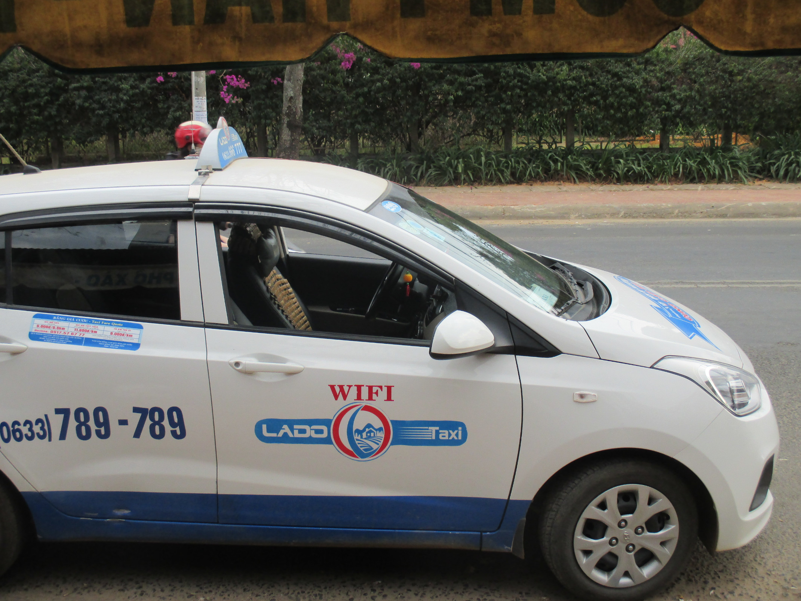
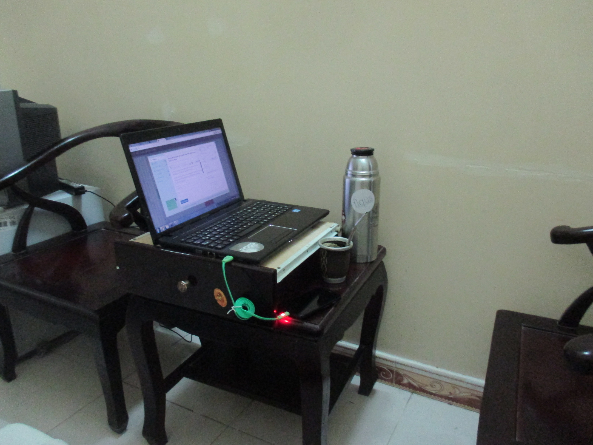

Trabajando en la terraza de la guesthouse en Bangkok junto a unos bloggers argentinos.

El tiempo ha pasado y encontré este borrador de un post que no debería haberse quedado en el tintero.. entiéndase que lo narrado es de hace un año aproximádamente. Aún así, espero lo disfruten. =) Y si quieren recordar el post anterior a éste, pueden leerlo [aquí](https://fiqus.coop/es/post/coop-travel).

Como bien leyeron en el título, se acaban mis días en el sudeste asiático (de ahora en más SA). Luego de 2 meses y algo más por estos pagos, es el momento de continuar con mi viaje hacia India y Nepal; no sin antes hablar de algunas cuestiones interesantes que pude ver en este tiempo viajando.

Me asombró increíblemente la disponibilidad de conexión que hay acá, tanto en buses de corta y larga distancia, como en taxis, ya sea en restaurantes, terminales de buses, hostels o supermercados, en todos lados se puede encontrar un cartel de "Free WiFi". El SA es un polo turístico que en los últimos años ha crecido enormemente, por sus bajos precios, su variedad gastronómica, increíbles destinos y lugares reconocidos mundialmente por su belleza (por ejemplo los templos de Angkor Wat en Siem Reap, Camboya).

Tal vez por tales motivos es que la oferta de conexión es tan grande, aunque también vale la pena mencionar la enorme cantidad de dispositivos móviles que se pueden ver aquí. Por curiosidad fui a un par de locales de tecnología donde pude ver la predominancia de celulares y tablets, ofreciendo poca cantidad y variedad de notebooks. En la calle se puede ver como todos (o casi) tienen celulares, con un alto porcentaje de smartphones (hasta he visto monjes con sus vestimentas naranjas sacando fotos con sus celulares). Quienes viajan se comunican, buscan alojamiento y hasta compran vuelos por medio de sus celulares.

En definitiva, la necesidad de conexión sea donde sea es muy alta, ya sea por estricta necesidad como la de los viajeros, como para entretenimiento de los locales (se los puede ver viendo programas de televisión, videos musicales y todo tipo de contenidos en cualquier momento sin importar el lugar).

Vale aclarar que la mayoría de los países que integran el SA están en situaciones de [pobreza](http://es.wikipedia.org/wiki/Anexo:Pa%C3%ADses_del_Sudeste_asi%C3%A1tico_por_PIB_%28nominal%29_pasado_y_futuro), con lo cual resulta extraño ver el desarrollo y ancho de banda ofrecido en general.

Otro tema interesante son los nómadas digitales, en general me alojé en lugares frecuentados por viajeros y mochileros, con lo cual no siempre se ofrece el mejor ámbito para quienes deben trabajar. No obstante, tuve oportunidad de cruzarme con una mujer finlandesa que estaba trabajando en su tesis de posgrado en Hoi An - Vietnam, quien por evitar el frío de su país, para concentrarse y por no contar con un gran presupuesto se inclinó por el SA. En el norte de Tailandia, más específicamente en Chiang Mai, me crucé con un italiano que trabajaba en marketing online desde una guesthouse en la que se sentía muy cómodo.

Más recientemente, me crucé con un dibujante que disfrutaba de la tranquilidad de Battambang en Camboya hace un año y medio mientras trabajaba en varios proyectos situados físicamente en Francia.

PD: no siempre se encuentran los mejores espacios para trabajar.
