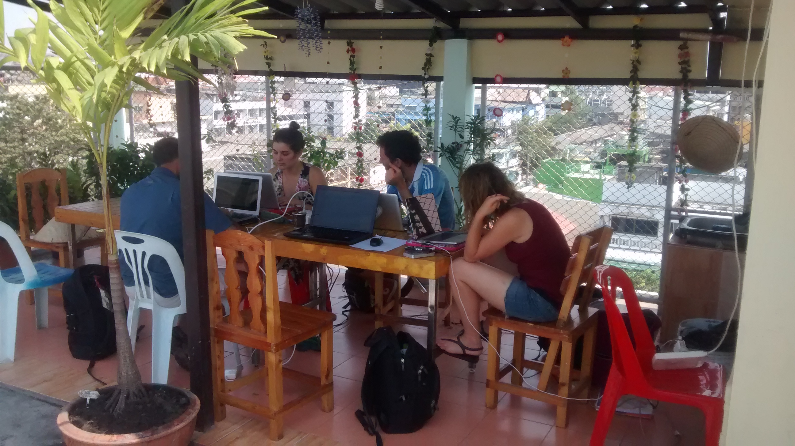
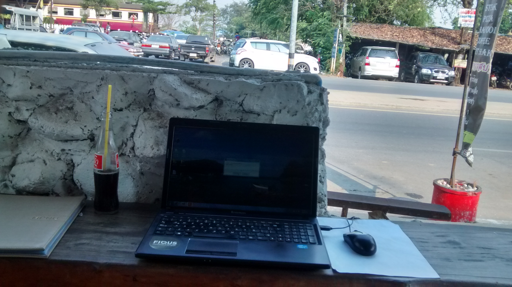

A veces tenemos grandes deseos de hacer cosas, de vivir experiencias o situaciones.. una de ellas para mí es viajar, y no solo irme de vacaciones a algún lugar, sino viajar y vivir el lugar en el que estoy. Tratando de comer la comida local, tomarse el colectivo, bote o lo que sea para moverse por la ciudad, aunque también conocer las atracciones del lugar. La parte interesante de este viaje es el deseo de seguir trabajando para la cooperativa, porque quienes sean parte de cooperativas entenderán lo lindo que es ésto y como se disfruta ser parte de una forma diferente de trabajo.

Trabajando en la terraza de la guesthouse en Bangkok junto a unos bloggers argentinos.

En mi caso el viaje arrancó en Sidney (Australia), con lo cual la diferencia horaria era el principal obstáculo, por suerte en la mayoría de los lugares por los que voy pasando encuentro buen ancho de banda, ya sea en los hostels o guesthouses donde me alojo, con lo cual no tengo la necesidad de terminar en algún lugar de comidas rápidas o café para usar internet. También existe la posibilidad de comprar tarjetas sim en el lugar donde esté, pero a veces el cambio de país es rápido y no justifica dicha compra (en Singapur estuve 3 días y no tenía sentido comprar una sim, asi que abusé de algunos cafés con internet).

Volviendo a la diferencia horaria, trataba de trabajar durante la noche para poder estar en contacto con los que compartía el proyecto y con mis compañeros de cooperativa; a veces era demasiado tarde o había recorrido mucho durante el día, con lo cual se complicaba un poco mantenerse despierto. A su vez, es importante mantener la comunicación con el cliente para conservar la buena relación y que día a día pueda verificar el cumplimiento de nuestra responsabilidad frente a las tareas asignadas.

Debo decir que con el paso del tiempo (ya van 70 días desde mi partida), me fui acomodando para que el viaje trabajando sea disfrutable. Vale aclarar que estoy trabajando la mitad de la jornada normal, sino sería muy dificil poder recorrer o vivir una ciudad. Lo que podría suceder es que se volvería mucho más lento mi viaje, ya que trabajando 8 horas, tratar de salir a conocer la ciudad se reduce a unas pocas horas.

Algo importante a considerar, el espacio de trabajo! Estando en alojamientos donde compartís la habitación o hay mucha gente viajando suele pasar que hay gente en "otra sintonía" por lo que es importante encontrar el espacio para poder trabajar, así como tener auriculares para poder concentrarse en la propia tarea (en mi caso particular es terriblemente necesario). Sin ir más lejos, mientras trabajaba en un espacio compartido cercano a mi habitación en Bangkok, llegó un grupo de personas algo pasadas de copas que se disculparon por el disturbio pero aún así, no podían controlar los ruidos que hacían.

Trabajando un poco mientras esperaba el tren nocturno para ir de Ayutthaya a Chiang Mai.

Convengamos que un viaje así es una situación particular, en Fiqus tratamos de que el trabajo y la cooperativa nos realice, nos haga sentir llenos y felices; hay momentos en los que nuestra felicidad puede estar relacionado con tratar de cumplir un sueño como es mi viaje, vivir en un lugar alejado de la ubicación física de la cooperativa, o cualquier otra cosa. Como personas y amigos que somos, tratamos de conversar para llegar al "mejor puerto" sobre las situaciones que pudieran surgir sobre la realidad que cada uno vive, sin dejar de lado la necesidad de cierta "reglamentación" de la situación.

Te gusta viajar? Te resulta posible trabajar a la distancia? Contanos qué te parece la idea de ser un [nómada digital](http://en.wikipedia.org/wiki/Digital_nomad)!