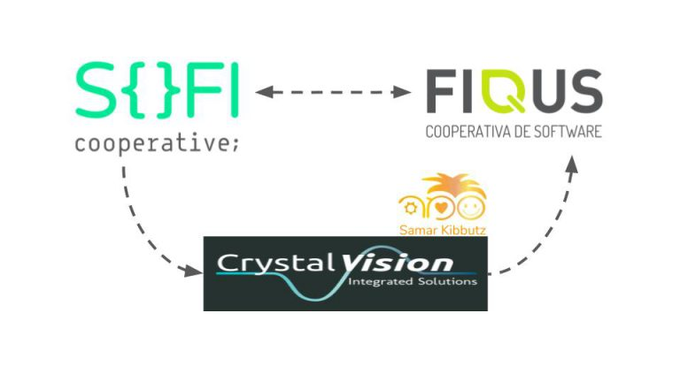

## En Fiqus comenzamos este 2020 con una gran experiencia de trabajo e intercooperación.

Todo comenzó conociendo a los amigxs de SofiCoop, una Cooperativa de Software con base en Israel. Parte de lxs SofiCoop estaban en contacto y haciendo voluntariado en CrystalVision, otra cooperativa israelí que a sí mismo está ubicada dentro la Comunidad Cooperativa de Kibbutz Samar en el bello desierto de Arava al sur de Israel.

Como parte de dicho voluntariado SofiCoop está a cargo de construir una aplicación web para uno de los productos de CrystalVision que consiste en un sistema de automatización de alimentación para la crianza de peces (piscicultura).

La idea de esa aplicación web (CrystalWebClient) es poder controlar de forma remota el sistema desktop de automatización (CrystalOPC). Pero faltaba algo para lograr dicha conexión, dado que el sistema desktop no podía exponer ninguna forma de comunicación hacia el exterior.

En ese momento SofiCoop ofrece a Fiqus ser parte del desafío. Nos arremangamos las jogginetas, metimos los pies en el agua (sin molestar a los peces) y empezamos a buscar una solución al problema.

Al principio nos costaba entender la necesidad a resolver, por tal motivo decidimos encarar el proyecto utilizando la técnica de Product Discovery.
Con esta técnica buscamos acercarnos al cliente, identificar sus necesidades y recopilar la información necesaria para tomar decisiones, adaptarnos y enfocar el desarrollo del producto hacia lo que el cliente realmente necesita.
El Product Discovery no solo nos ayuda a crear un producto de forma correcta, sino que también nos da las herramientas para crear el producto correcto.

Una vez identificada la necesidad, nos pusimos a pensar cual sería la mejor implementación que podíamos realizar. De ese debate técnico salió la idea de armar un WebServer que permita la comunicación entre la aplicación Web y la aplicación Desktop de forma centralizada, como una especia de pasamanos de mensajes entre ambas partes, y además este WebServer debería interactuar con una Base de Datos centralizada para obtener la información que la aplicación Web requiera.

Por un lado expusimos una API REST utilizando Django Rest Framework la cual puede ser consumida por la aplicación Web para pedir información sobre el estado actual del sistema de automatización, así como también puede realizar modificaciones sobre la configuración de los robots (PLCs) encargados de la alimentación de los peces (cantidad de comida a suministrar, intervalo entre comidas, etc.)

Para realizar dichas modificaciones es necesario crear un canal de comunicación entre el WebServer que recibe la petición y la aplicación desktop de CrystalVision que debe impactar los cambios en los robots (PLCs). Para ello, decidimos establecer una conexión mediante WebSockets y Django Channels vino al rescate para cumplir con esto.

La conexión por WebSocket también nos sirvió para establecer un protocolo que nos permita saber si la conexión con la aplicación desktop estaba viva o se había caído por algún motivo. Para ello la aplicación desktop primero establece la conexión, en este punto guardamos una key (clave) en un Redis (base de datos en memoria), dicha key tiene una expiración de 25 segundos (configurable). Luego cada 20 segundos la aplicación desktop emite un «heartbeat» hacia el WebServer lo que provoca una actualización en el tiempo de expiración de la key en Redis antes mencionada. Por lo tanto, mientras esa key exista en Redis, significa que la conexión esta viva. Si por algún motivo se dejan de recibir heartbeats, la key expirará y desaparecerá de Redis, lo que nos permite saber que en ese caso la conexión se ha caído y por lo tanto por ejemplo si la aplicación web nos envía alguna modificación, automáticamente rechazamos el pedido debido a que detectamos que la key no está presente.

A continuación les dejamos un diagrama que trata de resumir y aclarar un poco toda esta idea e implementación:

Por último, pero no menos importante, queremos contarles sobre la experiencia de intercooperación que fue muy enriquecedora.
Desde Fiqus siempre tratamos que la relación con los clientes vaya más allá de una relación cliente-proveedor. Nuestra forma natural de trabajar nos lleva a acercarnos al cliente, a sus problemas y necesidades, a sus costumbres y amalgamar eso con nuestras experiencias y costumbres para dar lugar a una relación más armoniosa y sincera.
En este caso esa búsqueda de relación fue muy natural, desde el principio fue como una relación de amistad, y si bien nos ha pasado con muchos clientes esto, creemos que el trabajo entre cooperativas lo estimula aún más.

Sin tienen dudas o comentarios tanto de la parte técnica como de la parte de intercooperación, no duden en escribirnos!