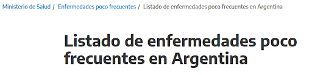
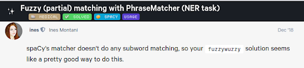

 
# PhruzzMatcher

## TL;DR
Cómo detectar frases que no necesariamente coinciden con una lista de valores con los que deberían coincidir? Spacy, RapidFuzz, NER y otras yerbas todas mezcladas.

## ¿Cómo llegamos a aquí?
En el último tiempo hemos estado trabajando intercooperativamente en IA² [0], un software de código abierto que integra un conjunto de herramientas desarrolladas para facilitar la transparencia en instituciones y fortalecer la vinculación con la ciudadanía mediante la anonimización de sentencias judiciales y la extracción de datos obtenidos mediante NER (Reconocimiento de Entidades Nombradas).
En parte por la experiencia que nos ofreció dicho proyecto y por las vinculaciones que fuimos haciendo, también trabajamos con el CIECTI [1] (Centro Interdisciplinario de Estudios en Ciencia, Tecnología e Innovación) en un prototipo para anonimización de HCE (Historias Clínicas Electrónicas).

## ¡Ahora si!
Y es de este proyecto que quería hablarles! (pero hacía falta una breve introducción)
Dentro de los requerimientos de este prototipo que teníamos que desarrollar estaba la necesidad de detectar EPoF (Enfermedades Poco Frecuentes). Dichas enfermedades están registradas a nivel nacional aquí [2], por lo que un acercamiento a su detección era armar una lista de EPoF y ver cuáles de ellas aparecían en los textos que se iban a anonimizar.

Luego de un poco de scrapping [3], generamos un archivo csv con dichas enfermedades.. Ahora había que buscar qué componente nos ofrecía Spacy [4] para poder detectarlas. 
Vale aclarar que tanto en IA² como en este prototipo para CIECTI, usamos Spacy por su capacidad en el desarrollo de modelos para producción, la performance que ofrece, la robustez y por las libertades que ofrece su calidad de Open Source.
Los modelos pre-entrenados ofrecidos por SpaCy ofrecen una razonable relación costo/beneficio, entiéndase costo como costo computacional de entrenar modelos y beneficio como precisión de predicción del modelo.
Dicho esto, en la búsqueda de un componente, encontramos que el que más se le “acercaba” era el PhraseMatcher [5]. Este componente de Spacy permite hacer coincidir eficazmente grandes listas de terminología; acepta patrones de coincidencia en forma de objetos Doc [6]. 
El problema es que sólo sirve si lo que buscas (una EPoF en este caso) aparece exactamente como fue escrito en el texto, es decir, no puede haber nada diferente (mucho menos un error al escribirlo o una abreviación que no fue considerada en el listado de EPoF). 
¿Alguna vez vieron a personal de la salud escribiendo una historia clínica? Tal vez no directamente, pero seguro estaban frente a una persona que escribía rápido en una computadora y al mismo tiempo les hacía preguntas, lo cual levanta sospechas sobre la existencia de algún error de tipeo, abreviaciones y vaya a saber cuántas otras particularidades en lo que escribió.
Por esa razón es que es necesario incorporar “algo” que permita cierta flexibilidad sobre lo que se busca, luego de buscar alternativas… [7]

## Houston tenemos un problema, o no!

Por fortuna el problema rápidamente desapareció, ¡apareció RapidFuzz! [8] Una librería de matcheo rápido de cadenas de caracteres (strings). Utiliza la distancia de Levenshtein [9] para calcular las diferencias entre secuencias de una manera sencilla y es más rápida que su competidora directa FuzzyWuzzy [10] (ver benchmark [11]).
Considerando que las EPoF se toman de un archivo csv que fue generado a partir de información encontrada en internet, pero no considera las diversas formas en las que las personas pueden referirse a ellas.
Finalmente se agregó esta librería para poder detectar casos en los que no haya una coincidencia perfecta entre tokens [12] y las enfermedades del listado de EPoF.
Pero no todo es tan simple o perfecto, la forma de evaluar la coincidencia es mediante la comparación de la “distancia” que separa a la EPoF y el fragmento de la HCE analizado con un porcentaje de “flexibilidad / tolerancia” configurado por nosotrxs.
Cuanto menor se configure el valor de ese porcentaje de tolerancia, mayor será la tolerancia que tenga el componente para detectar EPoF; hay que ser conscientes de que un valor demasiado bajo puede hacer que se encuentren muchas posibles coincidencias que deriven en un sobreprocesamiento para identificar dichas enfermedades.
El código que implementa lo comentado se extrajo a un componente separado para que pudiera ser utilizado por quien lo necesite (ver el Github del componente [13] y el componente en Pypi [14]), así como para poder publicarlo en el universo de Spacy [15].

 
## Conclusiones
Tanto el PhraseMatcher de Spacy como RapidFuzz son de mucha utilidad pero deben ser acompañados con un adecuado análisis alineado con los objetivos establecidos. Un uso erróneo de estos componentes podría dar lugar a la generación de gran cantidad de “falsos positivos” (detecciones de entidades donde en realidad no hay una entidad). 
Lo cual puede no ser un problema, siempre y cuando no perjudique a la lectura de una historia clínica o imposibilite comprender lo que intenta transmitir.
Sugerimos analizar la forma en que las personas escriben para poder enriquecer la lista de EPoF, así como cualquier otro elemento del código que haya sido creado en base a los textos que se pudieron analizar (por ejemplo, encontramos que escribieron “tto” para referirse a “tratamiento”).
El código del prototipo realizado para CIECTI se puede encontrar en el GitHub del proyecto [16].

## Fuentes y referencias
0: [IA²](https://www.ia2.coop/) 
1: [CIECTI | Centro Interdisciplinario de Estudios en Ciencia, Tecnología e Innovación](http://www.ciecti.org.ar/) 
2: [Listado de enfermedades poco frecuentes en Argentina](https://www.argentina.gob.ar/salud/pocofrecuentes/listado) 
3: [Web scraping](https://es.wikipedia.org/wiki/Web_scraping) 
4: [Language Processing Pipelines · spaCy Usage Documentation](https://spacy.io/usage/processing-pipelines) 
5: [PhraseMatcher · spaCy API Documentation](https://spacy.io/api/phrasematcher) 
6: [Doc · spaCy API Documentation](https://spacy.io/api/doc) 
7: [Fuzzy (partial) matching with PhraseMatcher (NER task) - usage](https://support.prodi.gy/t/fuzzy-partial-matching-with-phrasematcher-ner-task/1084/8) 
8: https://github.com/maxbachmann/RapidFuzz 
9: [Distancia de Levenshtein](https://es.wikipedia.org/wiki/Distancia_de_Levenshtein) 
10: https://github.com/seatgeek/fuzzywuzzy 
11: [maxbachmann/RapidFuzz: Rapid fuzzy string matching in Python using various string metrics](https://github.com/maxbachmann/RapidFuzz#benchmark) 
12: Un token es una instancia de una secuencia de caracteres en algún documento concreto que se agrupa como una unidad semántica útil para el procesamiento. Entonces al decir “token” nos referimos a una palabra, signo de puntuación, espacio, etc. 
13: https://github.com/mjvallone/phruzz-matcher 
14: https://pypi.org/project/phruzz-matcher/ 
15: https://spacy.io/universe/project/phruzz_matcher 
16: https://github.com/instituciones-abiertas/anonimizacion-texto-libre 
16: https://github.com/instituciones-abiertas/anonimizacion-texto-libre 
